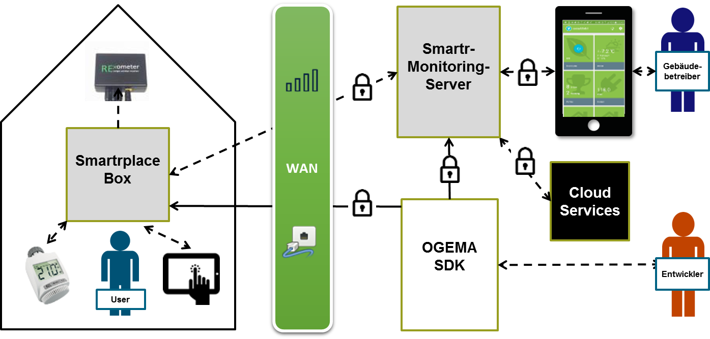

# SmartrPlatform - Baukasten aus Software, Hardwareanbindungen und technischen Prozessen für den Bereich Monitoring und Datenverarbeitung

# SmartrPlatform - Modular system of software, hardware connections and technical processes for monitoring and data processing

## Note for readers not comfortable reading the document in German
This wiki is currently available in German language only - we recommend [DeepL](https://www.deepl.com/en/translator) if you need a translation.

## Einführung
Basierend auf dem [OGEMA-Framework](http://www.ogema.org/) von Fraunhofer ist in verschiedenen Projekten ein „Baukasten“ an Software, Hardwareanbindungen, aber auch dokumentierten technischen Prozessen für den Bereich Monitoring und Datenverarbeitung mit Feld-Anbindung entstanden. Diesen „Baukasten“ wird im Folgenden auch als „SmartrPlatform“ bezeichnet. Die wichtigsten aktuellen Elemente des Baukastens sind in dem Artikel "SmartrMonitoring: Flexible Hardware, modulare Auswertung für Gebäude und Produktion" beschrieben, der voraussichtlich im Februar oder März in der Zeitschrift „Technik Nordhessen“ von VDE und VDI erscheinen wird (auf Anfrage gerne verfügbar).
Der Baukasten hat dabei einen Schwerpunkt auf der Realisierung von Monitoring-Lösungen inkl. Datenaufnahme und –Übertragung, Berechnung von zentralen Kenngrößen (KPIs), daraus abgeleiteter Generierung von Alarmen sowie der Möglichkeiten, auch Stammdaten und manuell erfasste Zeitreihen zu verwalten.

## Überblick
Als grundlegende technische Struktur besteht die SmartrMonitoring-Plattform aus einer Lösung für Rechner im Feld ("Gateways"), die z.B. in einzelnen Gebäuden installiert werden und einer Lösung für Server im Internet ("Cloud"), die die Daten von den Gateways aufnehmen, auswerten und ggf. Steuerungsfunktionen übernehmen, die von einem zentralen Punkt aus erfolgen müssen. Die Gateway-Lösung wird normalerweise mit der SmartrplaceBox auf Basis des Raspberry Pi realisiert, der SmartrMonitoring-Server nutzt das gleiche Betriebssystem basierend auf OGEMA (s. Technische Features). Außerdem ist auch die Realisierung der Kommunikation zwischen den Gateways und dem Server Bestandteil des Baukastens. Im Open Source-Bereich deckt die Lösung von [OpenEnergyMonitor](https://openenergymonitor.org/) grundsätzlich diese Systeme mit ab auf Basis der Open Source-Software [Emoncms](https://emoncms.org/), ist aber viel wengier flexibel bei der Erweiterung des Gateways um neue Treiber und bei der Realisierung von Steuerungsfunktionen. Es gibt auch einige Closed Source-kommerzielle Lösungen, die dieses Komplettsystem abdecken, die aber i.d.R. ein starkes Vendor-Lock In erzeugen, also eine sehr starke Abhängigkeit des Kunden vom Anbieter des Frameworks. Durch den Einsatz von Open Source-Software, dokumentierten Schnittstellen und der gemeinsamen Nutzung und Entwicklung von OGEMA mit mehreren Firmen und Institutionen soll dieses Problem für die Kunden vermieden werden. 
Durch den Einsatz des gleichen Frameworks sowohl auf dem Gateway als auch auf dem Server wird die Wartung und Pflege diverser Komponenten sehr vereinfacht. Da mit Embedded-Rechnern wie dem Raspberry Pi inzwischen für diesen Bereich sehr leistungsfähige kosten- und energieeffziente Plattformen bereitstehen, ist dies inzwischen gut möglich. Die Server-Lösung skaliert als einzelne Instanz bis zur Einbindung von etwas 1.000 bis 10.000 Nutzern/Gateways - wenn der Kundenkreis darüber hinaus wächst, müssen zusätzliche Server-Instanzen verwendet und ggf. synchronisiert werden. Durch die offene Architektur wäre aber dann ein Übergang zu einer hochskalierenden Architektur auch kein Problem. Das Framework ist daher ideal für kleine Teams, die neue Produkte auf den Markt bringen wollen und für die schnelle Markteinführung neuer dezentraler Produkte, die eine Datenaufnahme und ein Monitoring benötigen.

 
Überblick SmartrMonitoring-Struktur

## Technische Features
Im Folgenden werden wichtige Features und grundlegende technische Konzept kurz beschrieben, um einen Einblick zu geben, wie mit dem Baukasten (faktisch ein IoT-Framework) gearbeitet wird und in welchen Bereichen es besondere Stärken hat:
* Die API erlaubt die Entwicklung und Einbindung beliebiger zusätzlicher Module - sowohl für neue Anbindungen von Hardware und Daten als auch für zusätzliche Steuerungs- und Auswertungslogiken. Konkret unterscheiden wir hier 4 Typen:
  - Hardware-Treiber (Driver)
  - Einbindung externe Datenbanken (DataProvider)
  - Steuerungs-Anwendungen (Steuerungs-Logiken, Systemverwaltungsanwendungen, Direkt-Alarming etc.)
  - Auswertungen zur Berechnung von Key Performance Indicators für regelmäßige automatische Berichte und Alarming, s. [Einführung OGEMA Evaluation Framework](https://community.ogema-source.net/xwiki/bin/view/Tutorial%20Collection/SDK%20Tutorial%20Overview%20Experimental/The%20OGEMA%20Evaluation%20framework/)
* Konzentration bei Hardware-Anbindungen auf wichtige Standards: Das Framework bietet aktuell keine Hardware-Anbindungen für eine große Vielfalt an Herstellern und Protokollen, sondern konzentriert sich auf die effektive Unterstützung besonders wichtiger Protokolle. Die einfache Erweiterbarkeit der Hardware-Treiber für neue Gerätetypen und Datenmodelle innerhalb des Protokolls ist dabei besonders wichtig. Wichtige Protokolle sind Homematic, BACnet, MBUS/WMBUS, KNX, ModBus und Rexometer. Andere Geräte und Protokolle werden eher über Einbindung anderer IoT-Lösungen wie [openHAB](https://www.openhab.org/addons/) und [NodeRED](https://flows.nodered.org/?num_pages=1) nutzbar gemacht.
* Generierung von Nutzerseiten über ein einfaches Web-Framework (OGEMA Widgets), dessen Seiten vollständig duch Java-Code generiert werden und das für viele Funktionen des Baukastens vorgefertigte Komponenten bereithält wie z.B. eine Klasse zum Öffnen einer Seite zur graphischen Darstellung von Zeitreihen. Die Seiten und Komponenten können dabei mittels Java-Vererbung bei Bedarf leicht in modifizierter Form genutzt werden ohne große Mengen Quellcode zu doppeln, was später die Wartbarkeit des Systems stark beeinträchtigen würde. Das SmartrEfficiency-Framework setzt auf diesem OGEMA-Widget-Framework auf und erlaubt eine besonders einfache Definition von Seiten zur Dateneingabe und Navigation in der OGEMA-Datenbank (s. [SmartrEfficiencyExamples](Examples.md) ).
* Dieser Erweiterungsmechanismus kann auch bei vielen anderen Komponenten genutzt werden, für viele Treiber und Module existieren dokumentierte Erweiterungs-APIs ("Extension Points").
* OGEMA-basierte Lösung sowohl für die Gateways im Feld als auch für die Server-Lösungen zur zentralen Datenaufnahme und -auswertung. Hierdurch können viele Komponenten gleichermaßen für die Rechner/Gateways im Feld als auch auch dem Server genutzt werden.
* Für die Datenübertragung und Anbindung der Gateways für Softare-Updates, Zugriff auf das lokale Web-Interface und Fehler-Analyse existieren diverse Lösungen, z.B. zur Unterstützung unterschiedlicher Firewall-Konfigurationen, mobile Internetanbindung der Gateways etc. (Connectivity).
* Auch für die Organisation von Software-Updates existieren ja nach Anforderung unterschiedliche Lösungen einschließlich einer Appstore-Lösung, über die Entwickler Komponenten entsprechend der jeweils freigeschalteten Rechte zusätzliche Komponenten anbieten / verteilen können.
* Nutzerverwaltung mit Rechtverwaltung bezüglich Zugriff auf die Webseiten der Module (Apps) als auch bezüglich des Zugriffs auf Datenbankelemente (Ressourcen). Die Nutzerverwaltung steht sowohl auf den Gateways als auch den Servern zur Verfügung.
* Umfassende interne Dokumentation, wie Systeme bezüglich IT-Sicherheit zu konfigurieren sind (gegenwärtig nicht öffentlich).
* Sehr einfache Realisierung einer laufenden Überwachung des Dateneingangs von verschiedenen Gateways auf einem Server hinsichtlich Vollständigkeit, Korrektheit der aufgezeichneten Regelungsprozesse etc. Dies schließt auch die Konfiguration des entsprechenden Alarming etc. ein.
* Einfache Reproduktion der gesamten Konfigurations- und Datenumgebung von Gateways und Servern auf Entwicklungs-PCs. Da das System Java-basiert ist, können die gleichen Quellcode- und Binärdateien sowohl auf den Zielsystemen (i.d.R. Linux) und den Entwicklungs-PCs (häufig Windows) geutzt werden. Auf dem Entwicklungs-PC erlaubt dies ein effektives Testen und Debuggen des Code.
* Effektive Zusammenarbeit im kommerziellen Open Source-Bereich mittels Github und Maven Central. Gegenwärtig veröffentlichen hier zwei Partner Komponenten als Open Source (s. [OGEMA-Repositories von Fraunhofer](https://github.com/ogema) und [Open Source-Beiträge von Smartrplace](https://github.com/smartrplace), diese Art der Zusammenarbeit ist aber offen auch für weitere Teilnehmer.
* Das Verhalten von Geräten im Feld kann mittels einer eigenen Simulations-API auf dem Entwicklungs-PC emuliert werden, was die Entwicklung von Steuerungslogiken wesentlich vereinfacht. 
* Mit der SmartrplaceBox ist eine offene Hardware-Lösung für das Gateway im Feld kommerziell verfügbar.
* Smartrplatform nutzt wie OGEMA vor allem Java als Programmiersprache. Bei der Realisierung des Widget-Framework sowie Projekt-spezifischer Nutzerseiten kommt auch Javascript zum Einsatz. Für die Umsetzung diverser Prozesse und Funktionen sind außerdem Kenntnisse bezüglich Konfiguration und Scripting von Linux-Systemen (i.d.R. wird Debian genutzt) relevant.